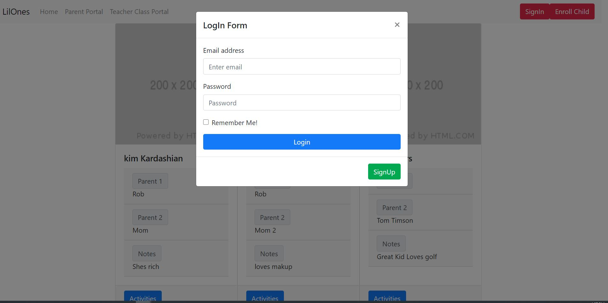

# Lil'Ones Daycare App

## Application Description
The Lil'Ones daycare application was created to streamline the interaction between parents and daycare providers. A user can log into the application using email and password identifaction. From there the application will enable parents to view their kids enrolled and what the activites they have done for the day. Daycare employees can create a new child and update the childs activites for the day.

## Technologies Used
Mongodb/Atlas,Express, Node.JS, React, Git

## Contributers
Scott Hoostal
Abinash Khanal
Abdi Ismail
Mike Marien

## Screenshots

  

